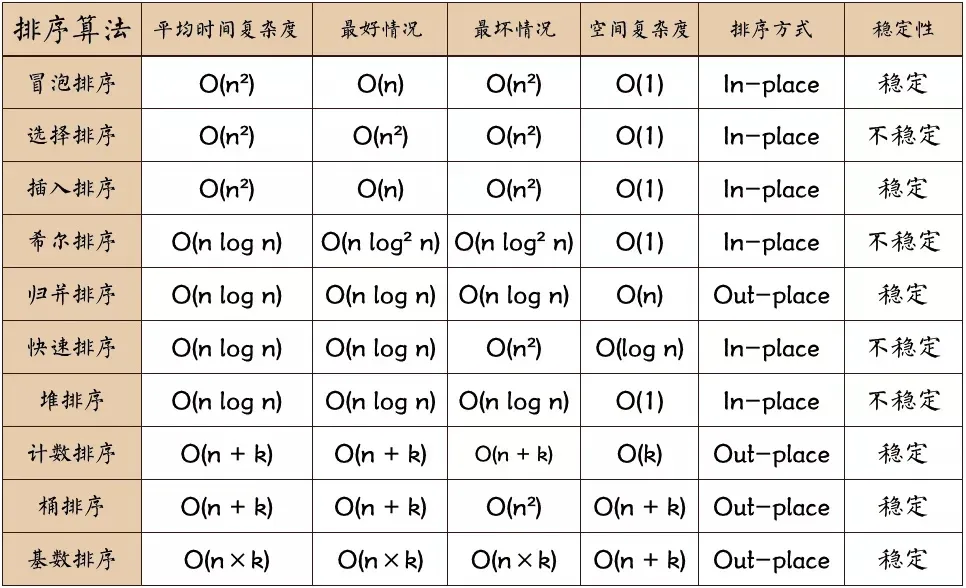

不同的排序算法在nums := []int{1, 4, 2, 7, 9, 6, 5, 8, 3, 10}的情况下的benchMark结果如下：
```shell

冒泡排序
Running tool: /usr/local/go/bin/go test -benchmem -run=^$ -bench ^BenchmarkBubbleSort$

goos: darwin
goarch: arm64
BenchmarkBubbleSort
BenchmarkBubbleSort-10          27694516                42.96 ns/op            0 B/op          0 allocs/op


Running tool: /usr/local/go/bin/go test -benchmem -run=^$ -bench ^BenchmarkBubbleSortPro$

goos: darwin
goarch: arm64
BenchmarkBubbleSortPro
BenchmarkBubbleSortPro-10       1000000000               0.0000001 ns/op               0 B/op          0 allocs/op


简单选择排序
Running tool: /usr/local/go/bin/go test -benchmem -run=^$ -bench ^BenchmarkSimpleSelectSort$

goos: darwin
goarch: arm64
BenchmarkSimpleSelectSort
BenchmarkSimpleSelectSort-10            22940620                51.89 ns/op            0 B/op          0 allocs/op

Running tool: /usr/local/go/bin/go test -benchmem -run=^$ -bench ^BenchmarkStraightInsertionSort$

直接插入排序
goos: darwin
goarch: arm64
BenchmarkStraightInsertionSort
BenchmarkStraightInsertionSort-10       64472296                18.68 ns/op            0 B/op          0 allocs/op

希尔排序

Running tool: /usr/local/go/bin/go test -benchmem -run=^$ -bench ^BenchmarkShellSortSort$

goos: darwin
goarch: arm64
BenchmarkShellSortSort
BenchmarkShellSortSort-10       41782304         28.37 ns/op            0 B/op           0 allocs/op

归并排序
Running tool: /usr/local/go/bin/go test -benchmem -run=^$ -bench ^BenchmarkMergeSortSort$

goos: darwin
goarch: arm64
BenchmarkMergeSortSort
BenchmarkMergeSortSort-10        2130241               560.2 ns/op           672 B/op             26 allocs

快速排序
Running tool: /usr/local/go/bin/go test -benchmem -run=^$ -bench ^BenchmarkQuickSort$

goos: darwin
goarch: arm64
BenchmarkQuickSort
BenchmarkQuickSort-10           22054752                51.61 ns/op            0 B/op          0 allocs/op

计数排序
Running tool: /usr/local/go/bin/go test -benchmem -run=^$ -bench ^BenchmarkCountingSort$

goos: darwin
goarch: arm64
BenchmarkCountingSort
BenchmarkCountingSort-10        18440473                66.13 ns/op          160 B/op          2 allocs/op


Running tool: /usr/local/go/bin/go test -benchmem -run=^$ -bench ^BenchmarkBucketSort$

goos: darwin
goarch: arm64
BenchmarkBucketSort
BenchmarkBucketSort-10           4185409               277.2 ns/op           432 B/op         11 allocs/op

```
